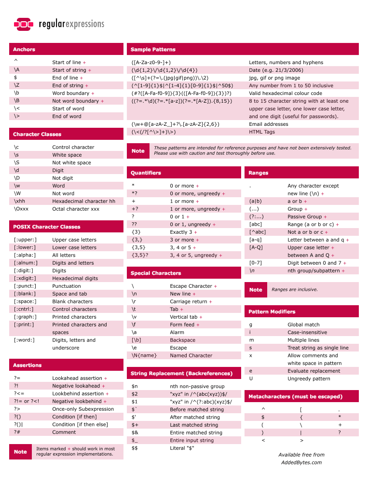

## Readings: APIs

- What does REST stand for?

```
epresentational State Transfer (REST) 
```

- REST APIs are designed around a ____.

```
resources
```

- What is an identifier of a resource? Give an example.


```
he target of an HTTP request is called a "resource", whose nature isn't defined further; 
it can be a document, a photo, or anything else. Each resource is identified by 
a Uniform Resource Identifier (URI) used throughout HTTP for identifying resources. URL is an example.
```

- What are the most common HTTP verbs?


```
POST, GET, PUT, PATCH, and DELETE.
```

- What should the URIs be based on?


```
resource URIs should be based on nouns (the resource) 
and not verbs (the operations on the resource)
```

- Give an example of a good URI.


```
a URL address
```

- What does it mean to have a ‘chatty’ web API? Is this a good or a bad thing?


```
web APIs that expose a large number of small resources.
Such an API may require a client application to send multiple requests to find all of the data that it requires. 
Instead, you might want to denormalize the data and combine related information into bigger 
resources that can be retrieved with a single request.
```

- What status code does a successful GET request return?


```
200
```

- What status code does an unsuccessful GET request return?


```
404
```

- What status code does a successful POST request return?


```
201
```

- What status code does a successful DELETE request return?


```
204
```

## Regular Expression


